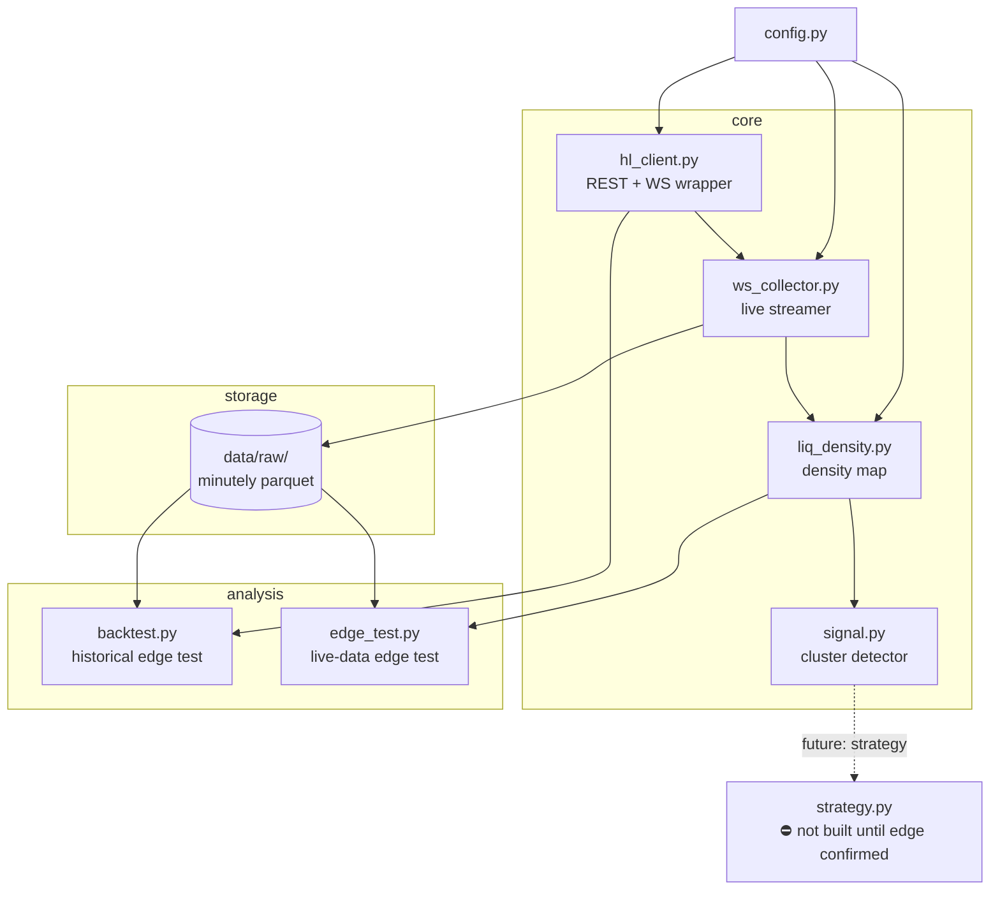
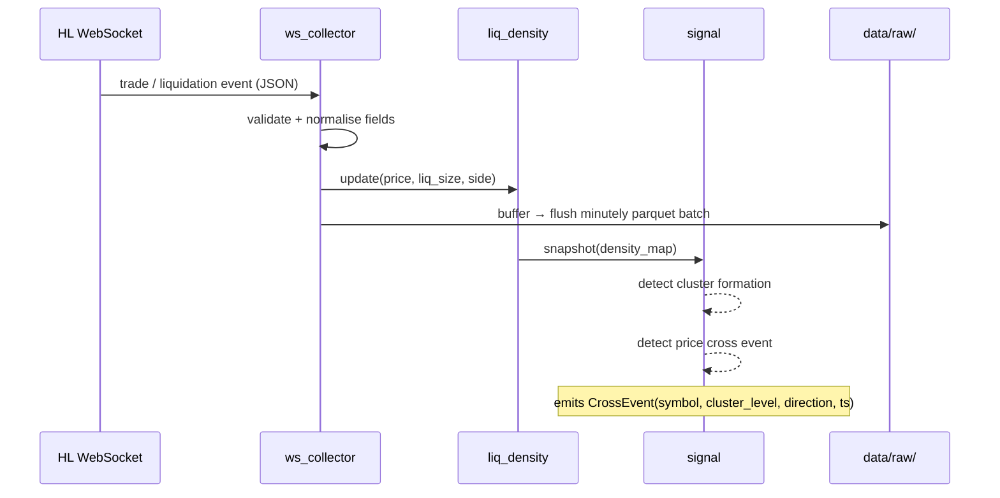
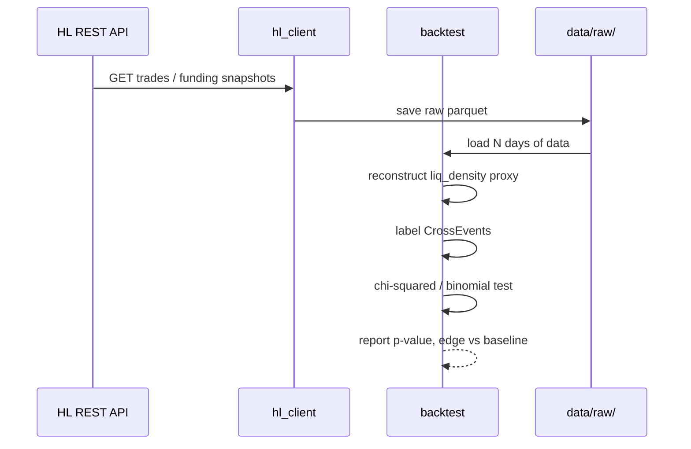

# Architecture — Module Dependency & Data Flow

## Module Dependency Graph



## Data Flow — Live Collection



## Data Flow — Historical Backtest (Step 1)



## Storage Layout

```
data/
└── raw/
    ├── trades/
    │   └── {symbol}/
    │       └── {YYYY-MM-DD}/
    │           └── {HH-MM}.parquet   # 1 file per minute
    └── liq_events/
        └── {symbol}/
            └── {YYYY-MM-DD}/
                └── {HH-MM}.parquet
```
